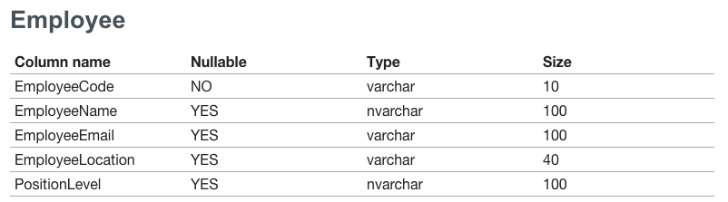

= sql2asciidoc
Chevdor
v0.1.0

== What is sql2asciidoc?

SQL => http://asciidoc.org/[Asciidoc]

+sql2asciidoc+ is a node package for lazy people who need to write documentation and want to do it quick but right.

It connects to your database, discovers the schemas and tables then generates an asciidoc document listing all the schemas, tables, their columns and type, size, etc...

The output using the https://chrome.google.com/webstore/detail/asciidoctorjs-live-previe/iaalpfgpbocpdfblpnhhgllgbdbchmia[Asciidoctor Live Preview Chrome Extension] for one table looks like:

Of course you can include this asciidoc text into your documents and render that as HTML, PDF, ePub, etc...

NOTE: You do not have to run this on a Windows machine as long as you can connect to your DB remotely.

== Installation
This is a regular npm package.

----
npm install sql2asciidoc
----

== Usage
[source, shell]
----
chevdor-imac:sql2asciidoc will$ node index.js --help
USAGE: node index.js [OPTION1] [OPTION2]... arg1 arg2...
  -s, --server <ARG1>   	Server\Instance ("localhost" by default)
  -l, --login <ARG1>    	Login ("sa" by default)
  -p, --pass <ARG1>     	Password ("sa" by default)
  -d, --database <ARG1> 	Database name (mandatory)
  -c, --schema <ARG1>   	Comma separated list of schemas. All if null.
----

=== Examples
.No filtering, all schemas, all tables
[source, shell]
----
node index.js -d <DB Name>
----

.One schema only
[source, shell]
----
node index.js -s "myserver\MyInstance" -d MYDB -c dbo
----

.Sample asciidoc output
----
== dbo

=== SomeConfig
[width="80%",frame="topbot",options="header,footer"]
|==== 
| Column name | Nullable | Type | Size 
| id| NO| uniqueidentifier| null
| paramKey| YES| varchar| 50
| paramValue| YES| varchar| 255
| valueType| YES| varchar| 50
| defaultValue| YES| varchar| 255
| description| YES| text| 2147483647
|==== 

== MySchema

=== SomeFolks
[width="80%",frame="topbot",options="header,footer"]
|==== 
| Column name | Nullable | Type | Size 
| EmployeeCode| NO| varchar| 10
| EmployeeName| YES| nvarchar| 100
| EmployeeEmail| YES| varchar| 100
| EmployeeLocation| YES| varchar| 40
|==== 

=== BrandName
[width="80%",frame="topbot",options="header,footer"]
|==== 
| Column name | Nullable | Type | Size 
| ID| NO| uniqueidentifier| null
| BrandNameID| YES| varchar| 50
| BrandNameName| YES| nvarchar| 100
|==== 

----

== Limitations & knownn issues

If you want to help with the following, please feel free to propose merge requests.

.Improvements
. For now not available as global command
. Output is not really customizable
. Auth is limited to user+password
. Cannot filter a *list* of schemas
. Using jsont ?
. Putting those stuff in the issue tracker
. Not yet possible to select the column properties

.Issues
. Closing the connection is not handled properly

== License

----
include::LICENSE[]
----
